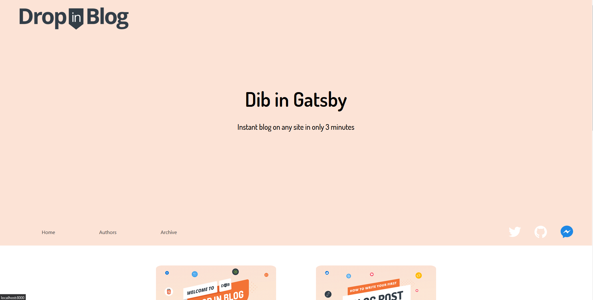
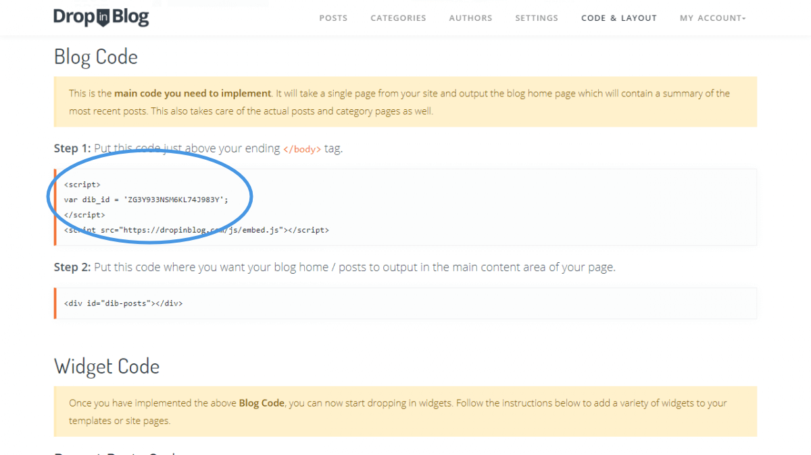

<p align="center">
  <a href="https://dropinblog.com">
    
  </a>
</p>
<h1 align="center">
  DropInBlog's Gatsby starter
</h1>

A Gatsby plugin for creating blogs from the headless [DropInBlog CMS](https://dropinblog.com/) 🚀.

## Demo

Check out our live [Demo](https://dropinblog-gatsby-starter.netlify.app/) on Netlify to check out how fancy it is.

<p class="text-center">
 
</p>

## Requirements

First you'll need to [create an account](https://dropinblog.com/signup/?plan=6) to pull data from, after that try creating some placeholder posts to make sure things are working later.

## Getting Started

If you have NPM or Yarn, you can clone the repo.

```terminal
$ git clone https://github.com/DropInBlog/gatsby-starter-dropinblog.git
$ yarn install
```

Or use the Gatsby CLI.

```terminal
$ gatsby new dropinblog-starter https://github.com/DropInBlog/gatsby-starter-dropinblog.git
```

When that's done all you need to connect to your account is to drop in your account's unique id into the [gatsby-source-dropinblog](https://github.com/DropInBlog/gatsby-source-plugin) plugin.

If you don't know your id log into your account at [DropInBlog](https://dropinblog.com/login/), go to the **Code & Layout** page, and use the id from the first snippet.

<p class="text-center">
 
</p>

With that, all of your data should be available as `dibPosts`, `dibAuthors`, and `dibCategories` ready to inspect in GraphiQL or GraphQL Playground, happy coding 😃.

## Essential Commands

### `yarn develop`

Run the site locally.

### `yarn build`

Build the production version of the site, I recommend starting out with [Netlify](https://www.netlify.com/).

### `yarn serve`

Run the built version of the site, just remember to run `yarn build` first.

### `yarn clean`

If you have any problems getting new data to update or any other abnormal behavior, this will clear Gatsby's cache and recompile/refetch everything from scratch.
